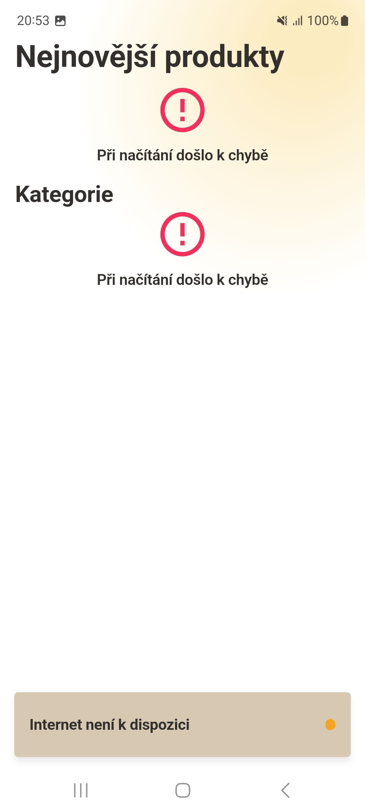

# Product Viewer

**Product Viewer** is a minimal demo project designed to showcase key app concepts and best practices in Flutter development. The app utilizes a feature-first folder structure and leverages powerful state management techniques, responsive design, and customizable theming. Data are loaded from **https://fakestoreapi.com/**.

## Key Features
- **BLoC for UI State Management**: The app uses the BLoC pattern for managing UI state, ensuring a clear separation of business logic and presentation.
- **State Caching with HydratedBloc**: State persistence is handled via HydratedBloc, allowing the app to cache BLoC states locally and restore them seamlessly.
- **Image Caching**: Images are efficiently cached using `CachedNetworkImageProvider`, improving performance and reducing data usage.
- **Skeletonizing**: Skeletonizing widgets during loading provides a smooth and visually engaging user experience.
- **Error Handling**: The app handles various errors, including backend failures, with informative feedback to the user.
- **Customizable Theming**: Theming options allow customization of colors and text styles, providing a flexible and consistent design language across the app.
- **Responsive Design**: Handles both portrait and landscape modes without layout overflows, ensuring a consistent user experience on different orientations.
- **Connectivity Awareness**: The app tracks network connectivity status, adjusting behavior based on the user's online or offline state.
- **Routing via AutoRoute**: Uses AutoRoute for managing app navigation, enabling type-safe and structured routing throughout the app.
- **Logging with Logger**: The app logs important events and errors using the logger package, aiding in debugging and issue resolution.

## Project Structure

The project follows a **feature-first** folder structuring approach. Each feature is encapsulated within its own folder, typically containing:

- **Models**: Defines the data structure used within the feature.
- **State Management**: Handles BLoC state logic specific to the feature.
- **Repository**: Manages data fetching and manipulation for the feature.
- **Widgets**: Contains UI components related to the feature.

At the app level, common components like snackbars, error widgets, and containers are organized into a **widgets** folder. Core utilities like the BaseController, theming files, and other globally important configurations are placed in the **core or app** directories.

## Getting Started

### Prerequisites

- **Flutter 3.24.0 or newer**: Ensure you have at least this version of Flutter installed to build and run the application.

### Building the App

1. Clone the repository:
2. Navigate to the project directory and run `flutter run` to install dependencies and launch the project on your emulator/physical device.

### App looks
<figure>
    
    <figcaption>Home Screen: Browse products with easy navigation.</figcaption>
</figure>

<figure>
    
    <figcaption>Product Detail Screen: Detailed view with product information.</figcaption>
</figure>

<figure>
    
    <figcaption>No Internet Snack: Displaying offline status notification.</figcaption>
</figure>

<figure>
    
    <figcaption>Handling Failed Requests: Display error message when data is unavailable.</figcaption>
</figure>

<figure>
    
    <figcaption>Handling Failed Image Cache: Display fallback UI for failed image loads.</figcaption>
</figure>